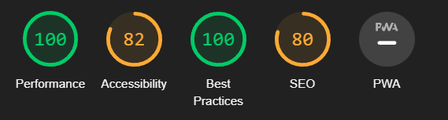

# odd-duck
Lab 11 - Code 201

## Problem Domain

Odd Duck Product Co is trying to decide which project from their R&D department they should invest in next to sell. They asked you to make a web page that they can run at a kiosk at the front entrance of their campus. Whenever an employee walks by, the employee can vote for 1 of the 3 products displayed that they think should be the next new product brought to market. After a week of collecting data, they would like some nice graphs to visualize the results.

To make this data collection project maximally effective, Odd Duck wants you to build an app that displays three potential products side-by-side-by-side, without favoring any single product. You’ll need to manage the size and the aspect ratio of the images.

As the app’s purpose is to have the staff members choose which product, of the three displayed images, that they would be most interested in seeing as a new creation, you will need to store each anonymous vote, calculate totals, and visually display the results.

To keep the product selection process as untainted as possible, you have been instructed to not allow any results to be shown to users until there have been a total of 25 selections made.

The marketing team is not only interested in the total number of clicks, but also the percentage of times that an item was clicked when it was shown. So, you’ll also need to keep track of how many times each image is displayed and do the calculations.

You are also responsible for the look and feel of the app, so don’t forget a custom font, color palette, layout with semantic HTML, and so on.

### User Stories

User stories are a device commonly used in software development to identify what the functionality and design of a product should be by considering the interests and motivations of people with varied multiple points of view. They are presented in the manner of

As a __, I want, so that __

This layout allows a client to communicate to a team what type of behavior they are looking for and allow the developer team to think up a solution that best fits the clients need.

The development team will then create sub-bullets called Feature Tasks which are individual tasks that must be completed by the developer to accomplish the user story. Once all of the feature tasks for an individual user story is completed, so is the story.

Below are your lab requirements in this format. Try and think up what the feature tasks would be for each story, once your done, or you get stuck, review the provided feature tasks to see what the actual tasks are for each story.

- lab 11:
    > 